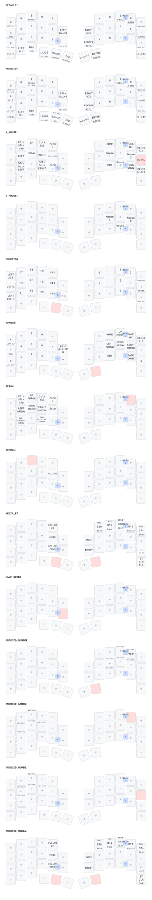

# zmk-config-roBa

Current keymap: [source](config/roBa.keymap) · [Android shortcuts](ANDROID.md)

The diagram is generated from the current keymap on main. Center labels show taps;
bottom labels show holds unless prefixed with a modifier or `2x` (double tap).
`Win:` and `Alt:` labels describe Android shortcut conversions.

- Left Win holds Win + NUMBER; right Win keeps the base letter layout.
- Android: right Win + L = screen off; left Win + O = Gemini.
- History uses ordinary Alt + Tab. Win + Tab has no custom conversion.
- ANDROID_NUMBER / ARROW / MOUSE / MEDIA are automatic overlays; transparent keys
  inherit from the active shared layers. See ANDROID.md for activation conditions.
- HALF_SPEED (2) sits below the mouse and scroll layers so reduced speed does not override their modes.
- `LANG`: single tap LANGUAGE_2, double tap LANGUAGE_1 (host/IME dependent).

